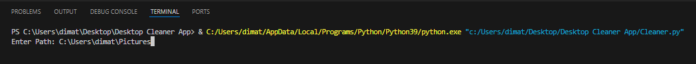
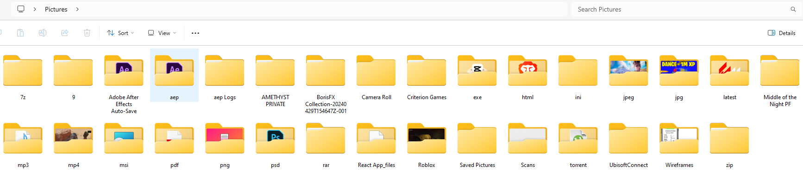

# DesktopCleaner---Python

This application allows you to import your directirory on your computer and the files will automatically be sorted into folders with their extensions i.e. all .png files are placed into a .png folder. All the folders are then sorted alphabetically within the file directory.

